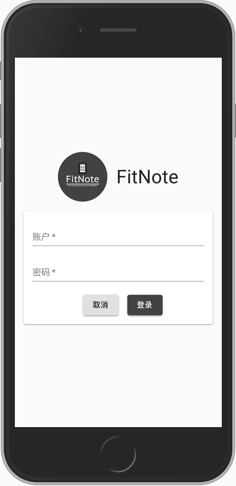
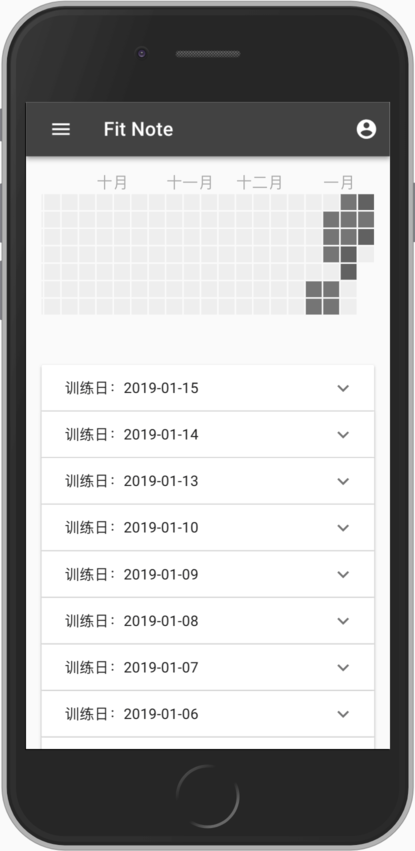
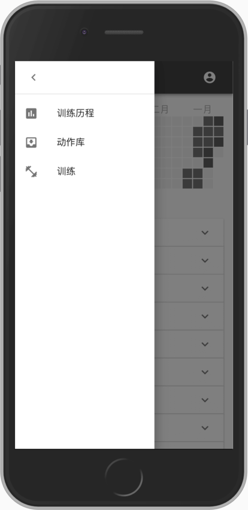
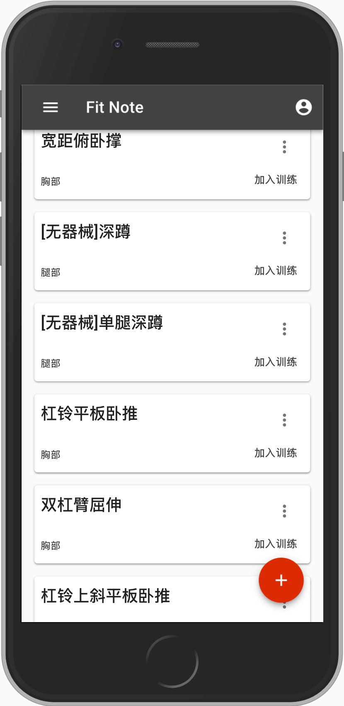
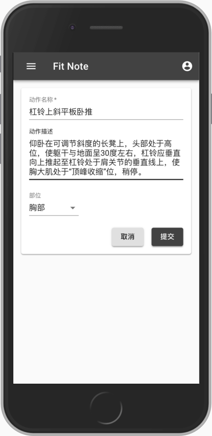
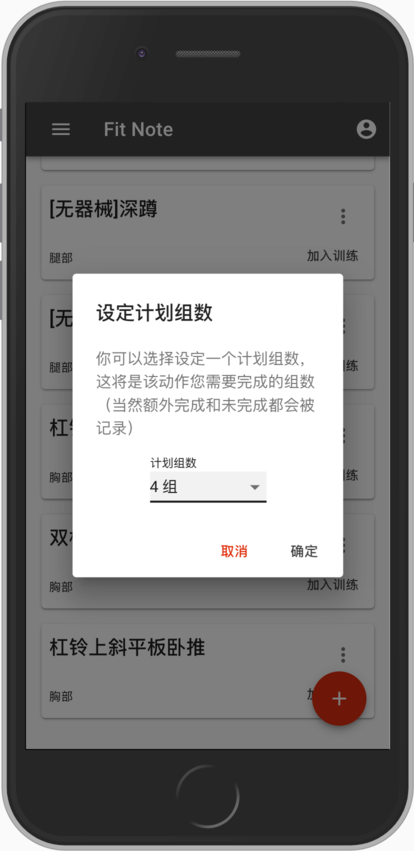
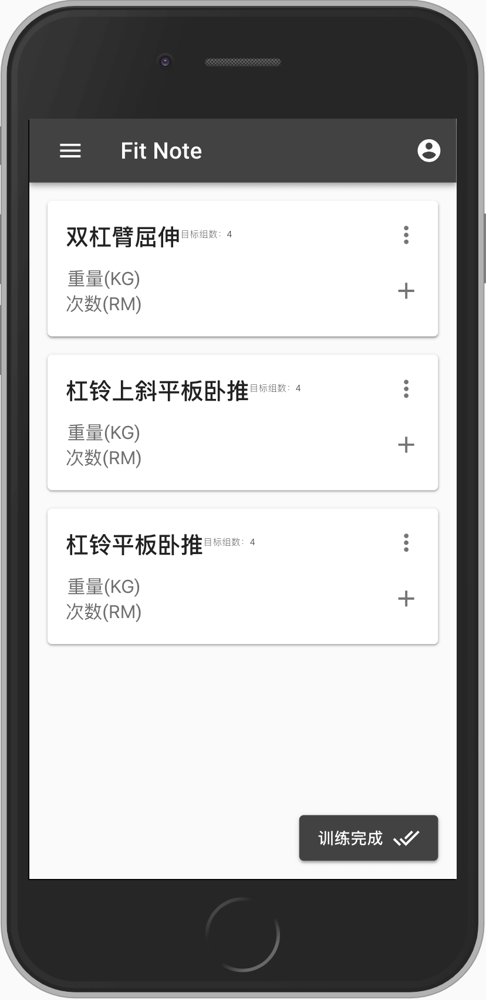
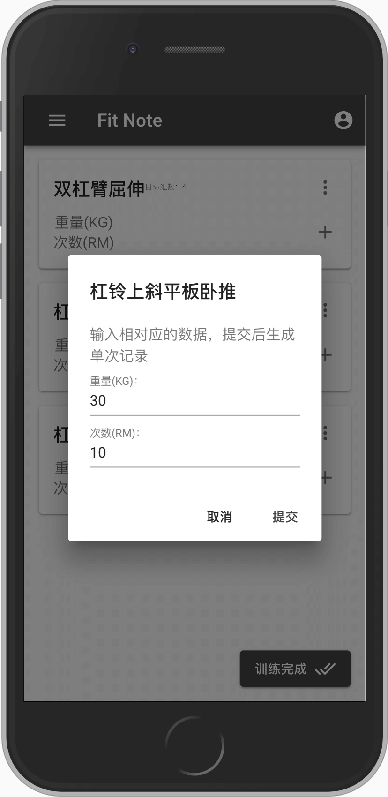
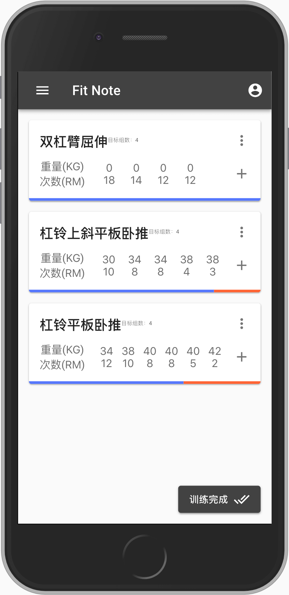

# FitNote使用说明

FitNote的诞生是为了更好地记录在力量训练中负重的变化情况，也可以说是力量训练笔记本。

## 使用

FitNote可以像原生应用一样添加到手机App中，无需下载。

经测试：
- 新版IOS系统的Iphone支持。
- 部分使用Chrome的安卓手机支持。
- 小米手机支持。

浏览器打开[https://fitnote.inhere.top/](https://fitnote.inhere.top/)

1. 登录

**注意：**目前版本暂时未对外开放，如有需要请联系我开通内测版账号。

2. 训练历程

训练历程最上方展示的是训练全年记录，下方显示的是完成训练的项目。

左边的菜单目前一共有三个分类，“训练历程、动作库、训练”，下一步就是去动作库创建动作。

3. 创建动作

动作页面展示所有自己创建的动作

点击“+”号按钮创建动作

4. 添加训练

在动作页面可以看见动作卡片右下角有加入训练，也就是将动作安排进今天的训练之中。加入训练可以预先设定一个预期目标，也就是计划训练组数。

5. 执行训练

执行训练计划，在每个训练卡片后面点击“+”号按钮，添加每组训练数据。

训练卡片右上角的按钮，包含撤销本次训练记录，以及删除该训练。

训练卡片再添加训练数据后，在底部会有颜色区分，蓝色是计划内训练，红色是额外组。

6. 完成训练查看训练历程

训练结束后，需要点击完成训练，才会被视为一次有效的训练从而出现在训练历程页面。

如果当日没有完成训练，次日将不再显示当日未完成的训练。
